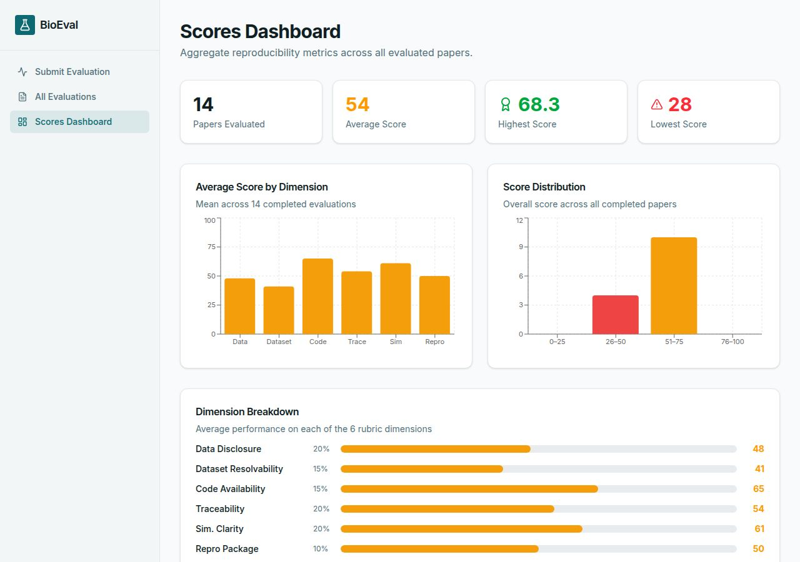

# BioEval — Computational Simulation Paper Evaluator

An AI-powered tool that scores computational and simulation research papers on data transparency, reproducibility, and code availability. Researchers paste a URL or upload a PDF; Claude analyses the paper across six dimensions and returns a structured report with findings, gaps, and recommendations.



---

## Scoring Rubric

Each paper is evaluated on six weighted dimensions (0–100):

| Dimension | Weight | What it measures |
|---|---|---|
| **Data Disclosure** | 20% | Datasets listed with repo links, accession IDs, version, access method |
| **Dataset Resolvability** | 15% | Identifiers actually resolve and metadata matches the paper |
| **Code Availability** | 15% | Code is public, versioned, archived, and documented |
| **Traceability** | 20% | Every data-loading step maps back to a declared dataset |
| **Simulation Clarity** | 20% | Parameters, distributions, and seeds are traceable to cited sources |
| **Reproducibility Package** | 10% | Environment + workflow + test data + instructions + checksums |

---

## Evaluated Papers

| Score | Paper | Domain |
|---|---|---|
| 68.3 | [Tellurium: Reproducible dynamical modeling in systems biology](https://doi.org/10.1016/j.biosystems.2018.07.006) | Systems biology |
| 68.0 | [Mixture density networks for epidemiological IBMs](https://journals.plos.org/ploscompbiol/article?id=10.1371/journal.pcbi.1006869) | Epidemic simulation |
| 67.8 | [HAL: Hybrid Automata Library for agent-based modeling](https://journals.plos.org/ploscompbiol/article?id=10.1371/journal.pcbi.1007635) | Agent-based modeling |
| 67.5 | [Brian2: Python simulator for spiking neural networks](https://elifesciences.org/articles/47314) | Neural simulation |
| 63.0 | [Covasim: Agent-based COVID-19 simulation](https://journals.plos.org/ploscompbiol/article?id=10.1371/journal.pcbi.1009149) | Epidemic simulation |
| 57.6 | [PhysiCell: Open-source multicellular systems simulator](https://journals.plos.org/ploscompbiol/article?id=10.1371/journal.pcbi.1005991) | Tissue simulation |
| 57.3 | [GeNN: GPU-accelerated brain simulation framework](https://www.nature.com/articles/srep18854) | Neural simulation |
| 57.0 | [OpenABM-Covid19: Agent-based COVID-19 intervention model](https://journals.plos.org/ploscompbiol/article?id=10.1371/journal.pcbi.1009052) | Epidemic simulation |
| 56.0 | [BeeStack: Scaffold for whole-colony honeybee simulation](https://zenodo.org/records/20420557) | Agent-based modeling |
| 55.0 | [ABCpy: Approximate Bayesian Computation framework](https://www.jstatsoft.org/article/view/v100i07) | Statistical simulation |
| 54.0 | [The Ant Stack: Ant-inspired simulation workspace](https://zenodo.org/records/16782757) | Agent-based modeling |
| 51.3 | [NetPyNE: Python package for multiscale neural modeling](https://elifesciences.org/articles/44494) | Neural simulation |
| 38.0 | [Smoldyn: Spatial stochastic simulation of cellular kinetics](https://journals.plos.org/ploscompbiol/article?id=10.1371/journal.pcbi.1002705) | Particle simulation |

---

## Insect Simulation Series

A focused evaluation of fourteen publicly available insect colony and swarm simulations — bees, ants, termites, and fireflies — scored June 2026. Code Availability and Reproducibility Package are scored against **live GitHub repository signals** (license, releases, dependency manifests, tests, CI, recency), so every dimension is continuous rather than snapped to rubric tiers. Full per-paper PDF reports available on request.

### Rankings

| Rank | Score | Repo | Type | Language | Stars |
|---|---|---|---|---|---|
| 1 | **62.0** | [lrdcxdes/ant-simulation](https://github.com/lrdcxdes/ant-simulation) | 🐜 Ant | Python | — |
| 2 | **56.0** | [docxology/BeeStack](https://github.com/docxology/BeeStack) | 🐝 Bee | Python | — |
| 3 | **54.0** | [fractastical/antstack](https://zenodo.org/records/16782757) | 🐜 Ant | Python | — |
| 4 | **52.0** | [lax4mike/firefly](https://github.com/lax4mike/firefly) | 🔆 Firefly | JS | — |
| 5 | **48.0** | [Dougarasu/termite-multiagent-system](https://github.com/Dougarasu/termite-multiagent-system) | 🪳 Termite | C#/Unity | — |
| 6 | **44.0** | [fractastical/bee-swarm-sim](https://github.com/fractastical/bee-swarm-sim) | 🐝 Bee | HTML/JS | — |
| 7 | **43.0** | [bones-ai/rust-ants-colony-simulation](https://github.com/bones-ai/rust-ants-colony-simulation) | 🐜 Ant | Rust | ★208 |
| 8 | **33.0** | [tulustul/ants-sandbox](https://github.com/tulustul/ants-sandbox) | 🐜 Ant | TypeScript | ★106 |
| 8 | **33.0** | [Haghrah/ACO---Robot-Path-Planning](https://github.com/Haghrah/ACO---Robot-Path-Planning) | 🐜 Ant | Python | ★61 |
| 8 | **33.0** | [cfrBernard/ant-colony-optimization](https://github.com/cfrBernard/ant-colony-optimization) | 🐜 Ant | JS/React | ★34 |
| 11 | **31.0** | [piXelicidio/locas-ants](https://github.com/piXelicidio/locas-ants) | 🐜 Ant | Lua/Love2D | ★161 |
| 11 | **31.0** | [MeoMix/symbiants](https://github.com/MeoMix/symbiants) | 🐜 Ant | Rust | ★235 |
| 13 | **22.0** | [darwiiiish/swarm-abc](https://github.com/darwiiiish/swarm-abc) | 🐝 Bee | HTML/JS | — |
| 13 | **22.0** | [matheuslosilva/Hardware-Accelerated-Ant-Colony...](https://github.com/matheuslosilva/Hardware-Accelerated-Ant-Colony-Based-Swarm-System) | 🐜 Ant | C++/CUDA | ★12 |

### Dimension Breakdown

| Repo | Data Disclosure | Dataset Resolvability | Code Availability | Traceability | Sim Clarity | Repro Pkg | **Overall** |
|---|---|---|---|---|---|---|---|
| ant-simulation (pygame) | 72 | 78 | 63 | 68 | 55 | 52 | **62.0** |
| BeeStack | 52 | 38 | 68 | 55 | 58 | 42 | **56.0** |
| antstack | 52 | 48 | 72 | 42 | 46 | 62 | **54.0** |
| firefly | 62 | 58 | 58 | 55 | 48 | 32 | **52.0** |
| termite-multiagent | 62 | 58 | 42 | 55 | 52 | 28 | **48.0** |
| bee-swarm-sim | 52 | 48 | 55 | 42 | 38 | 62 | **44.0** |
| rust-ants-colony | 62 | 55 | 52 | 28 | 32 | 38 | **43.0** |
| ants-sandbox | 28 | 38 | 58 | 18 | 20 | 35 | **33.0** |
| ACO-robot-path-planning | 32 | 38 | 48 | 42 | 30 | 8 | **33.0** |
| ant-colony-optimization | 38 | 42 | 52 | 22 | 18 | 30 | **33.0** |
| locas-ants | 28 | 35 | 62 | 18 | 18 | 42 | **31.0** |
| symbiants | 18 | 22 | 58 | 10 | 12 | 38 | **31.0** |
| swarm-abc | 18 | 28 | 42 | 15 | 20 | 8 | **22.0** |
| hw-accel-ant-colony | 12 | 18 | 38 | 15 | 10 | 20 | **22.0** |

### Key Findings per Paper

**🐜 [ant-simulation (pygame)](https://github.com/lrdcxdes/ant-simulation)** — 62.0/100  ·  #1
> Pygame stigmergy ant colony with emergent intelligence from simple pheromone rules. MIT license, requirements.txt with the three core dependencies (Pygame, NumPy, SciPy). The clear series leader once repository signals are read.
- ✅ Tops the series on Data Disclosure (72) and Dataset Resolvability (78) — generative rules and config are well specified
- ✅ Explicit dependency manifest plus strong Traceability (68)
- ❌ Dependencies unpinned (pygame==, numpy==, scipy==)
- ❌ No release tag, commit hash, or Zenodo archive

**🐝 [BeeStack](https://zenodo.org/records/20420557)** — 56.0/100  ·  #2
> Whole-colony honeybee simulation scaffold. Code archived on Zenodo with MD5 checksums, tagged release, MIT license, large passing test suite.
- ✅ Strong Code Availability (68) and the best Simulation Clarity in the series (58)
- ✅ Versioned release + SHA checksums; CLI-driven artifact regeneration
- ❌ Primary DOI does not resolve in Crossref → Dataset Resolvability only 38
- ❌ Citation-to-parameter mapping partially opaque

**🐜 [antstack](https://zenodo.org/records/16782757)** — 54.0/100  ·  #3
> SHA-256 checksummed manifest system, comprehensive tests, CLI-driven artifact regeneration. External data sources (VFB, hemibrain) named in prose only without DOIs.
- ✅ Leads the series on Code Availability (72) and Reproducibility Package (62)
- ✅ SHA-256 provenance per run; comprehensive test suite
- ❌ No resolvable dataset identifiers; data sources named in prose only
- ❌ Heuristic constants undocumented → Sim Clarity 46

**🔆 [firefly](https://github.com/lax4mike/firefly)** — 52.0/100  ·  #4
> JavaScript firefly synchronization simulation. Live demo at mikelambert.me/firefly. Jumped from near-last to the top tier once repo signals were read properly.
- ✅ Solid Data Disclosure (62) and Dataset Resolvability (58) — a simple, fully specified model
- ✅ Live deployed demo for interactive inspection
- ❌ Sparse README; no parameter, initialization, or seed documentation
- ❌ No release or archive → lowest Repro Package in the top tier (32)

**🪳 [termite-multiagent-system](https://github.com/Dougarasu/termite-multiagent-system)** — 48.0/100  ·  #5
> Unity/C# 3D termite colony. Agent behavior reduced to two IF-THEN rules, clearly documented in README. MIT license.
- ✅ Behavioral rules and environment structure well documented → Data Disclosure 62
- ❌ Weak Code Availability (42) — no dependency manifest, release, or tests detected
- ❌ No datasets or accession numbers of any kind

**🐝 [bee-swarm-sim](https://github.com/fractastical/bee-swarm-sim)** — 44.0/100  ·  #6
> Client-side agent-based waggle dance simulation. Runs zero-dependency in a browser. Citation-backed mode references 9 peer-reviewed sources (von Frisch 1967, Seeley 1995, Couvillon 2019, Menzel 2023 and others). BeeStack trace replay and JSON export supported.
- ✅ Strongest Reproducibility Package in the series (62) — self-contained with trace export
- ✅ Explicit citation-backed vs. heuristic mode distinction
- ❌ Only 4 commits, no tagged release, no Zenodo DOI
- ❌ Stochastic with no seed control → Sim Clarity 38

**🐜 [rust-ants-colony-simulation](https://github.com/bones-ai/rust-ants-colony-simulation)** — 43.0/100  ★208  ·  #7
> Ant colony simulation in Rust (Bevy engine). Clear repo structure; `cargo run --release` startup; KD-tree and query caching documented.
- ✅ Good Data Disclosure (62) and Dataset Resolvability (55)
- ✅ `cargo run --release` one-liner launch
- ❌ Low Traceability (28) — algorithmic choices not mapped back to sources
- ❌ No versioned release, pinned commit, or Zenodo archive

**🐜 [ants-sandbox](https://github.com/tulustul/ants-sandbox)** — 33.0/100  ★106  ·  #8
> TypeScript/web ant colony. Live demo at ants-sandbox.vercel.app; MIT license; npm install + run documented.
- ✅ Decent Code Availability (58) — standard, runnable npm repo
- ❌ Very low Traceability (18) and Sim Clarity (20)
- ❌ No datasets, citations, or parameter documentation

**🐜 [ACO-robot-path-planning](https://github.com/Haghrah/ACO---Robot-Path-Planning)** — 33.0/100  ★61  ·  #8
> Python ACO for robot path planning, explicitly tied to a published reference (Liu et al., 2017, Soft Computing). GPL-3.0.
- ✅ Linked to a specific peer-reviewed paper
- ❌ Lowest Reproducibility Package in the series (8) — no environment or test files
- ❌ No data availability statement or accession numbers

**🐜 [ant-colony-optimization](https://github.com/cfrBernard/ant-colony-optimization)** — 33.0/100  ★34  ·  #8
> React + HTML5 canvas ACO visualizer. MIT license; sprite/tileset/map assets bundled in-repo.
- ✅ Bundled map/asset files give non-trivial Dataset Resolvability (42)
- ❌ Low Traceability (22) and Sim Clarity (18)
- ❌ Only 14 commits, no tagged release or DOI

**🐜 [locas-ants](https://github.com/piXelicidio/locas-ants)** — 31.0/100  ★161  ·  #11
> Lua/Love2D ant colony remake. 6 versioned releases; pre-built `.love` binary available; MIT license.
- ✅ Best Code Availability in the bottom tier (62) — versioned releases + binary download
- ❌ Pheromone decay rates and ant rules undocumented → Traceability/Sim Clarity 18
- ❌ No biological citations or dataset references

**🐜 [symbiants](https://github.com/MeoMix/symbiants)** — 31.0/100  ★235  ·  #11
> Rust/Bevy ant colony simulation game. Dual Apache-2.0/MIT license; devcontainer setup; native + WASM builds.
- ✅ Well-documented dev environment → Code Availability 58
- ❌ No biological data sources or parameter citations → Traceability 10, Sim Clarity 12
- ❌ Most-starred repo in the series, yet near the bottom on reproducibility

**🐝 [swarm-abc](https://github.com/darwiiiish/swarm-abc)** — 22.0/100  ·  #13
> Artificial Bee Colony algorithm in HTML/JS. Public code; explanation page included.
- ✅ Explanation page documents algorithm intent
- ❌ No README, no license, no parameter config, no citations
- ❌ Reproducibility Package 8 — not practically rerunnable

**🐜 [hw-accel-ant-colony](https://github.com/matheuslosilva/Hardware-Accelerated-Ant-Colony-Based-Swarm-System)** — 22.0/100  ★12  ·  #13
> C++/CUDA/OpenGL hardware-accelerated ant colony swarm. 38 commits, clear structure.
- ✅ GPU-accelerated implementation (CUDA + OpenGL)
- ❌ Weakest Data Disclosure (12) and Dataset Resolvability (18) in the series
- ❌ No benchmark scenarios, documented results, or test files

### Cross-Series Observations

- **Popularity ≠ reproducibility.** The two most-starred repos (symbiants ★235, rust-ants ★208) land at #11 and #7; the top scorer (pygame ant-simulation) has no stars listed at all.
- **Stigmergy done simply wins.** The pygame ant-simulation is the clear #1 — explicit dependency manifest, documented rules, and the best-specified generative model in the series.
- **Code Availability now actually discriminates.** Scoring against live GitHub signals (license, releases, manifests, tests, CI, recency) spreads this dimension from 38 (bare repos like hw-accel) to 72 (ant-stack), instead of collapsing every public repo into one value.
- **No external datasets — but specification quality varies widely.** These are rule-based sims, so none deposit accessioned data. Scoring resolvability of the *synthetic-data definition* instead spreads the field from 18 (hw-accel) to 78 (pygame ant): the gap is how completely rules, parameters, and configs are written down.
- **The fastest path to a higher score** is: (1) pin dependency versions and add a deterministic seed, (2) add a parameters table mapping every constant to its source, (3) tag a release and archive to Zenodo for a DOI, (4) commit one example output file with a checksum.

---

## Features

- **Submit by URL or PDF upload** — paste a journal link or drag-and-drop a PDF
- **Real PDF text extraction** — uploaded and URL-linked PDFs are parsed to text (via `unpdf`) and scored on their actual contents; if a PDF yields too little readable text (e.g. a scanned image), the evaluation is flagged as an error instead of scoring an empty document
- **Multi-agent pipeline** — four Claude agents extract evidence, resolve dataset accessions, score dimensions, and audit weak claims
- **Full report** — findings, gaps, and prioritised recommendations per paper
- **Code analysis** — paste simulation code to trace each segment back to the data sources and citations it depends on
- **Dashboard** — aggregate stats across all evaluated papers with score distribution and dimension breakdown
- **PDF reports** — generate and email structured PDF reports for any subset of evaluations
- **Hardened ingestion** — SSRF-guarded URL fetching (blocks private/loopback/link-local targets and re-validates every redirect hop), upload size/MIME/magic-byte checks, capped/timed downloads, locked CORS, request body limits, and rate limiting

---

## Stack

- **Frontend:** React + Vite + Tailwind + shadcn/ui
- **API:** Express 5 + OpenAPI (contract-first, Orval codegen)
- **DB:** PostgreSQL + Drizzle ORM
- **AI:** Anthropic Claude via Replit AI Integrations
- **PDF extraction:** `unpdf` (bundled pure-JS pdf.js — no native deps)
- **Email:** Resend
- **Security:** SSRF-guarded fetch, `express-rate-limit`, locked CORS, body-size limits
- **Build:** pnpm workspaces, esbuild, Node.js 24, TypeScript 5.9

---

## Running Locally

```bash
# Install dependencies
pnpm install

# Start API server (reads PORT from env)
pnpm --filter @workspace/api-server run dev

# Start frontend (reads PORT from env)
pnpm --filter @workspace/biopaper-eval run dev

# Push DB schema changes (dev only)
pnpm --filter @workspace/db run push

# Regenerate API hooks after spec changes
pnpm --filter @workspace/api-spec run codegen

# Generate and email a report (defaults to IDs 12, 35, 36, 37, 38, 39, 40, 41)
pnpm --filter @workspace/scripts run send-report

# Or pass specific evaluation IDs
pnpm --filter @workspace/scripts run send-report 12 36
```

**Required environment variables:**
- `DATABASE_URL` — PostgreSQL connection string
- `AI_INTEGRATIONS_ANTHROPIC_BASE_URL` — auto-provisioned by Replit
- `AI_INTEGRATIONS_ANTHROPIC_API_KEY` — auto-provisioned by Replit

---

## Repository Structure

```
artifacts/
  api-server/          # Express API + evaluation pipeline
  biopaper-eval/       # React frontend
lib/
  api-spec/            # OpenAPI contract (source of truth)
  db/                  # Drizzle schema + migrations
  integrations-anthropic-ai/  # Anthropic client
scripts/
  src/sendReport.ts    # PDF report generator + email sender
docs/
  dashboard.jpg        # Dashboard screenshot
```
